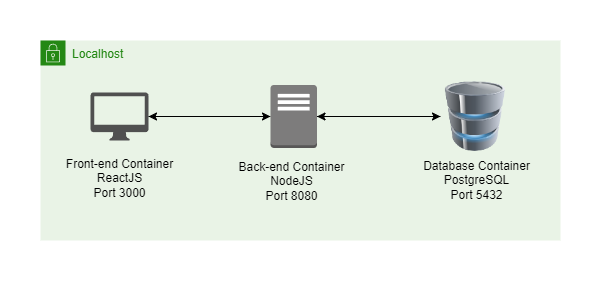
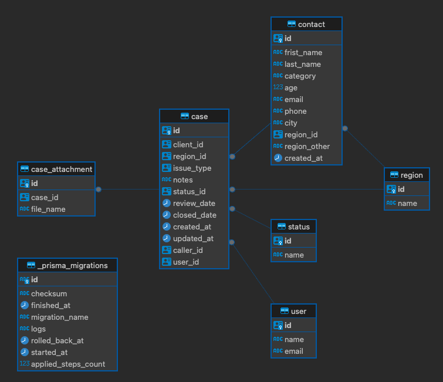

# Table of Contents

# Demo Videos

# Steps to Build & Deploy

## Requirements

- Docker (CLI, Engine, and Compose)

## Running the application

1. Make sure Docker daemon is running.
2. Navigate to the project root directory and open a terminal.
3. Run `docker compose up --build`command in the terminal. Wait for Convergence logo to be displayed in the terminal (might take <= 5 minutes on the first run).
4. Navigate to `localhost:3000` in a web browser (preferrably Google Chrome).

# User Stories

# Technology Stack

1. Front-end:
   - The front-end is built with TypeScript using `ReactJS`. `Jest` is used for testing.
2. Back-end:
   - The backend is built with `TypeScript` using `NodeJS`. It uses `ExpressJS` for routing and `Prisma` as an Object Relational Mapper (ORM) for the database. `Yup` is used for validation. Testing is achieved through `Jest` and it uses `JSON Web Tokens` for authentication. The `awesome-rtk` library is built and managed by Convergence.
3. Database:
   - The database is built in `PostgreSQL`.

# Architectural Diagram & Explanation

1. Front-end:
   - The ReactJS application runs inside a Docker container on port 3000.
   - It communicates with the backend in the form of GET, POST, PUT and PATCH requests.
2. Back-end:
   - The NodeJS application runs inside a Docker container on port 8080.
   - It communicates with the database in order to respond to requests from the front-end.
   - The API documentation for the back-end can be found in the `./documentation/api-docs.json` file. The contents of the file can be pasted in the editor at [https://editor.swagger.io/](https://editor.swagger.io/) for an interactive interface.
3. Database:
   - The PostgreSQL database runs inside a Docker container on port 5432.
   - It only serves data to the back-end

# Testing

We have used the `Jest` library for preliminary testing on the backend. The test suites can be found under the `tests` sub-folder under the `backend` folder. To run the tests, navigate to the backend folder and run the `npm run test` command.

# Data Design

# Future Improvements

# Appendix: Deployment to the Cloud (AWS)

# License

This project is licensed under the Apache License 2.0 - see the [LICENSE](LICENSE.txt) file for details.
